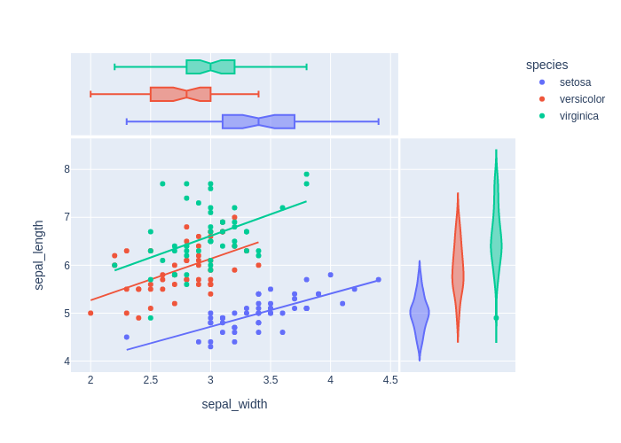

Much of the analysis of MD simulations involves creating plots and graphs to summarize the data. The Python environment of Google Colab provides access to many of most popular plotting programs including R, Matplotlib, Seaborn, Plotly, and others. After reading about the pros and cons of the various packages I settled on [Plotly](https://plotly.com/). Plotly is powerful, offers 3D graphing and interactive plots, and has flexible styling for making publication-quality figures. And of course, it runs well in Jupyter notebooks.

## Learning Objectives

At the end of this exercise, students will be able to do the following:

1. Install Plotly in Colab.
2. View a data table.
3. Create an interactive plot of the data in a table.
4. Add style to figures to enhance the visual hierarchy to easily distinguish the important elements from the peripheral.
5. Combine multiple plots into a single figure.
6. Locate additional resources on using Plotly in Colab.

## Resources

- [Plotly Tutorial for Beginners](https://www.kaggle.com/kanncaa1/plotly-tutorial-for-beginners): Nice examples for most of the types of plots one would use.  
- [Plotly Basics](https://learn.co/lessons/plotly-basics): This tutorial explains the code very well.  
- [Getting Started with Plotly in Python](https://plotly.com/python/getting-started/): Go to the source for getting Plotly up and running.  
- [Data Visualization with Plotly Express](https://www.coursera.org/projects/data-visualization-plotly-express)  
- [Getting Plotly working in Jupyter Lab and fastpages](https://colab.research.google.com/github/binnisb/blog/blob/master/_notebooks/2020-04-02-Plotly-in-lab.ipynb)  
- [Plotly Express in Python](https://plotly.com/python/plotly-express/)

## Getting Started

- Switch to appropriate Google Account.
- Start a new notebook.
- Make sure you are still in the appropriate account.
- Mount Google Drive.

First, see if Plotly is installed:

```py
import plotly
plotly.__version__
5.5.0 # Plotly 5.5 is already installed in Colab
```

### Saving Images of Plots

I want to include a few images of the plots produced by Plotly in this website even though it is not needed in Colab. See [Static Image Export in Python](https://plotly.com/python/static-image-export/) for instructions.

```py
pip install -U kaleido
```

!!! warning

    The `pip` installation did not work. I kept getting an error message that `kaleido` was not installed even though it installed successfully. This was solved by installing `kaleido` using `conda`.

```py
!pip install -q condacolab
import condacolab
condacolab.install()
```

Once the kernel reboots, you are good to go.

Okay. Now we can export a plot as an image by including `fig.write_image("fig1.png")` in our code.

### Using Plotly in Colab

Let's plot something. See [IV_Plotly](https://colab.research.google.com/github/pytrain/iViz/blob/master/IV_Plotly.ipynb#scrollTo=2ljXzS-h9Gym) for most of the code, below.

```py
import plotly.graph_objects as go
import numpy as np

fig = go.Figure()

config = dict({'scrollZoom': True})

fig.add_trace(
    go.Scatter(
        x=[1, 2, 3],
        y=[1, 3, 1]))

fig.show(config=config)
fig.write_image("fig1.png")
```

<figure markdown>
  { width="400" }
  <figcaption>Here is a Plotly plot</figcaption>
</figure>

Let's try another plot.

```py
import plotly.express as px
iris = px.data.iris()
fig = px.scatter(iris, x="sepal_width", y="sepal_length", color="species", marginal_y="violin",
           marginal_x="box", trendline="ols")
fig.show()
fig.write_image("fig2.png")
```

{ width="600" }

!!! success

And my favorite--a box plot!

{ width="600" }

Let's look at the underlying data as a table.

```py
import plotly.graph_objects as go
import pandas as pd

import plotly.express as px

df = px.data.tips()

fig = go.Figure(data=[go.Table(
    header=dict(values=list(df.columns),
                fill_color='paleturquoise',
                align='left'),
    cells=dict(values=df.values.T,
               fill_color='lavender',
               align='left'))
])

fig.show()
fig.write_image("fig3.png") # make a figure
```

{ width="600" }

!!! note

    The table is scrollable in Colab

I uploaded some `.dat` files from RMSD measurements from analyzing an MD trajectory in VMD.

Here is some useful Plotly information:

- `df.index` returns the list of the index, in our case, it’s just integers 0, 1, 2, …, 97.
- `df.columns` gives the list of the column (header) names.

This code:

```py
import plotly.graph_objects as go
import pandas as pd

import plotly.express as px

df = pd.read_csv('/content/rmsd-core.dat',
           sep='\s\s+', engine='python')
           
df.columns
```

Returns: `Index(['frame', 'mol0'], dtype='object')`

```py
df.mol0 # gets the data in the specified column
# this wont work if the column has a space in it
```

```bash
0       NaN
1     0.405
2     0.507
3     0.606
4     0.657
      ...  
93    1.914
94    1.898
95    1.951
96    1.953
97    1.932
Name: mol0, Length: 98, dtype: float64
```

See [Get values in rows and columns in Pandas](https://pythoninoffice.com/get-values-rows-and-columns-in-pandas-dataframe/)

```
dataframe['column name']
```
dataframe = df
use double square brackets for multiple columns

```
dataframe[ ['column name 1', 'column name 2', 'column name 3', ... ] ]
```

`df.loc[row, column]`. column is optional, and if left blank, we can get the entire row.

Let's look at one of the files I uploaded to Colab, `msd-core.dat`.

```py
import plotly.graph_objects as go
import pandas as pd
import plotly.express as px

df = pd.read_csv('/content/rmsd-core.dat',
           sep='\s\s+', engine='python')

# The above code creates a dataframe (df) from reading a csv file.
# our file was not really a csv file, so we need to specify
# the delimiter (spaces, using Regex), and the engine 
# that does the reading

fig = go.Figure(data=[go.Table(
    header=dict(values=list(df.columns),
                fill_color='paleturquoise',
                align='center'),
    cells=dict(values=[df.frame, df.mol0],
                fill_color='lavender',
                align='left'))
])

# The above code creates a figure from the dataframe,
# and styles the header and the cells of the table.

fig.update_layout(width=500) # limits the table to a width of 500px
fig.show() # shows the figure
fig.write_image("rmsd-core.dat.png") # make a png of the figure
```

{ width="400"}

#### Styling Plots

To make it easier to assign colors to plots, I included a cell that contains code to produce swatches of named colors that will work in Colab. This code comes from the [List of named colors](https://matplotlib.org/stable/gallery/color/named_colors.html) page from the [Matplotlib documentation website](https://matplotlib.org/stable/index.html). On Colab, I put this code into a form so I can keep it out of the way.

=== "Color Figure"

    

=== "Code"

    ```py
    #@title Named Colors Code

    """
    ====================
    List of named colors
    ====================

    This plots a list of the named colors supported in matplotlib. Note that
    :ref:`xkcd colors <xkcd-colors>` are supported as well, but are not listed here
    for brevity.

    For more information on colors in matplotlib see

    * the :doc:`/tutorials/colors/colors` tutorial;
    * the `matplotlib.colors` API;
    * the :doc:`/gallery/color/color_demo`.
    """

    from matplotlib.patches import Rectangle
    import matplotlib.pyplot as plt
    import matplotlib.colors as mcolors


    def plot_colortable(colors, title, sort_colors=True, emptycols=0):

        cell_width = 212
        cell_height = 22
        swatch_width = 48
        margin = 12
        topmargin = 40

        # Sort colors by hue, saturation, value and name.
        if sort_colors is True:
            by_hsv = sorted((tuple(mcolors.rgb_to_hsv(mcolors.to_rgb(color))),
                            name)
                            for name, color in colors.items())
            names = [name for hsv, name in by_hsv]
        else:
            names = list(colors)

        n = len(names)
        ncols = 4 - emptycols
        nrows = n // ncols + int(n % ncols > 0)

        width = cell_width * 4 + 2 * margin
        height = cell_height * nrows + margin + topmargin
        dpi = 72

        fig, ax = plt.subplots(figsize=(width / dpi, height / dpi), dpi=dpi)
        fig.subplots_adjust(margin/width, margin/height,
                            (width-margin)/width, (height-topmargin)/height)
        ax.set_xlim(0, cell_width * 4)
        ax.set_ylim(cell_height * (nrows-0.5), -cell_height/2.)
        ax.yaxis.set_visible(False)
        ax.xaxis.set_visible(False)
        ax.set_axis_off()
        ax.set_title(title, fontsize=24, loc="left", pad=10)

        for i, name in enumerate(names):
            row = i % nrows
            col = i // nrows
            y = row * cell_height

            swatch_start_x = cell_width * col
            text_pos_x = cell_width * col + swatch_width + 7

            ax.text(text_pos_x, y, name, fontsize=14,
                    horizontalalignment='left',
                    verticalalignment='center')

            ax.add_patch(
                Rectangle(xy=(swatch_start_x, y-9), width=swatch_width,
                        height=18, facecolor=colors[name], edgecolor='0.7')
            )

        return fig

    plot_colortable(mcolors.BASE_COLORS, "Base Colors",
                    sort_colors=False, emptycols=1)
    plot_colortable(mcolors.TABLEAU_COLORS, "Tableau Palette",
                    sort_colors=False, emptycols=2)

    # sphinx_gallery_thumbnail_number = 3
    plot_colortable(mcolors.CSS4_COLORS, "CSS Colors")

    # Optionally plot the XKCD colors (Caution: will produce large figure)
    # xkcd_fig = plot_colortable(mcolors.XKCD_COLORS, "XKCD Colors")
    # xkcd_fig.savefig("XKCD_Colors.png")

    # to save a copy of this figure
    # plt.savefig('named-colors.png')

    # plt.savefig must be before plt.show
    plt.show()


    #############################################################################
    #
    # .. admonition:: References
    #
    #    The use of the following functions, methods, classes and modules is shown
    #    in this example:
    #
    #    - `matplotlib.colors`
    #    - `matplotlib.colors.rgb_to_hsv`
    #    - `matplotlib.colors.to_rgba`
    #    - `matplotlib.figure.Figure.get_size_inches`
    #    - `matplotlib.figure.Figure.subplots_adjust`
    #    - `matplotlib.axes.Axes.text`
    #    - `matplotlib.patches.Rectangle`
    ```

### Making Plots

Okay, let's plot some data. I uploaded `.dat` files from the RMSD analysis in VMD for three different domains of the Adk protein. We can look at the RMSD of each domain separately.

First I'll try to reproduce the plot made by VMD.

```py
import plotly.graph_objects as go
import pandas as pd
import plotly.express as px

df = pd.read_csv('/content/rmsd-core.dat', sep='\s\s+', engine='python')

fig = px.line(df, x="frame", y="mol0", title='RMSD of CORE',
labels=dict(frame="simulation frame", mol0="RMSD vs t=0")
)
fig.update_layout(width=600)
fig.show()
```

{ width="500" }

!!! success

Now let's try the LID domain. I already uploaded the `rmsd-lid.dat` file. We'll start by looking at the data table.

```py
import plotly.graph_objects as go
import pandas as pd

import plotly.express as px

df = pd.read_csv('/content/rmsd-lid.dat',
           sep='\s\s+', engine='python')
           
df.columns
```

The output is: `Index(['frame', 'mol0'], dtype='object')`, and we see that the columns are labeled `frame` and `mol0` like before.

=== "Table"

    { width="400" }

=== "Code"

    ```py
    import plotly.graph_objects as go
    import pandas as pd
    import plotly.express as px

    df = pd.read_csv('/content/rmsd-lid.dat',
            sep='\s\s+', engine='python')

    fig = go.Figure(data=[go.Table(
        header=dict(values=list(df.columns),
                    fill_color='paleturquoise',
                    align='center'),
        cells=dict(values=[df.frame, df.mol0],
                    fill_color='lavender',
                    align='left'))
    ])
    fig.update_layout(width=500)
    fig.show()
    ```

!!! success

Let's make a plot.

=== "Plot"

    { width="500" }

=== "Code"

    ```py
    df = pd.read_csv('/content/rmsd-lid.dat', sep='\s\s+', engine='python')

    fig = px.line(df, x="frame", y="mol0", title='RMSD of LID Domain',
    labels=dict(frame="simulation frame", mol0="RMSD vs t=0")
    )
    fig.update_layout(width=600)
    fig.show()
    ```

!!! success

It would be useful to see all traces on the same figure. Let's give it a whirl.

In this method, each `.dat` file is read into a separate dataframe, and individual figures are produced. Each figure can be styled independently. Then all the figures are combined into one composite figure.

=== "Figure legend top"

    { width="500" }

=== "Code legend top"

    ```py
    import plotly.express as px
    import plotly.graph_objects as go
    import pandas as pd

    # Create dataframes for each file
    df = pd.read_csv('/content/rmsd-core.dat', sep='\s\s+', engine='python')
    df2 = pd.read_csv('/content/rmsd-lid.dat', sep='\s\s+', engine='python')
    df3 = pd.read_csv('/content/rmsd-nmp.dat', sep='\s\s+', engine='python')

    # create figure 1
    fig1 = px.line(df, x="frame", y="mol0") # x and y are the column names
    # change the color of the trace and add a name for the legend
    fig1.update_traces(line=dict(color = 'violet'), 
                    name="RMSD-core")

    # create figure 2
    fig2 = px.line(df2, x="frame", y="mol0")
    # change the color of the trace and add a name for the legend
    fig2.update_traces(line=dict(color = 'deepskyblue'), 
                    name="RMSD-lid")

    # create figure 3
    fig3 = px.line(df3, x="frame", y="mol0")
    # change the color of the trace and add a name for the legend
    fig3.update_traces(line=dict(color = 'goldenrod'), 
                    name="RMSD-nmp")

    # construct the composite figure
    fig4 = go.Figure(data=fig1.data + fig2.data + fig3.data)

    # add the legend and the axes titles
    fig4.update_traces(showlegend=True)
    fig4.update_xaxes(title_text="Simulation Frame")
    fig4.update_yaxes(title_text="RMSD vs t=0")

    # change the graph width and add a graph title
    fig4.update_layout(width=600, title_text="RMSD for adk")

    # to anchor the legend in the top left of the graph, this works:
    # fig4.update_layout(width=600, title_text="RMSD for adk",
    #                     legend=dict(
    #     yanchor="top",
    #     y=0.99,
    #     xanchor="left",
    #     x=0.01
    # ))

    # show the graph
    fig4.show()
    ```

=== "Figure legend bottom"

    { width="500" }

=== "Code legend bottom"

    ```py
    import plotly.express as px
    import plotly.graph_objects as go
    import pandas as pd

    # Create dataframes for each file
    df = pd.read_csv('/content/rmsd-core.dat', sep='\s\s+', engine='python')
    df2 = pd.read_csv('/content/rmsd-lid.dat', sep='\s\s+', engine='python')
    df3 = pd.read_csv('/content/rmsd-nmp.dat', sep='\s\s+', engine='python')

    # create figure 1
    fig1 = px.line(df, x="frame", y="mol0") # x and y are the column names
    # change the color of the trace and add a name for the legend
    fig1.update_traces(line=dict(color = 'violet'), 
                    name="RMSD-core")

    # create figure 2
    fig2 = px.line(df2, x="frame", y="mol0")
    # change the color of the trace and add a name for the legend
    fig2.update_traces(line=dict(color = 'deepskyblue'), 
                    name="RMSD-lid")

    # create figure 3
    fig3 = px.line(df3, x="frame", y="mol0")
    # change the color of the trace and add a name for the legend
    fig3.update_traces(line=dict(color = 'goldenrod'), 
                    name="RMSD-nmp")

    # construct the composite figure
    fig4 = go.Figure(data=fig1.data + fig2.data + fig3.data)

    # add the legend and the axes titles
    fig4.update_traces(showlegend=True)
    fig4.update_layout(
        legend=dict(
            # the x and y positions will put legend in bottom middle of the figure
            x=0.4,
            y=0,
            title_text="Legend",
            bgcolor="whitesmoke"
            )
            )
    fig4.update_xaxes(title_text="Simulation Frame")
    fig4.update_yaxes(title_text="RMSD vs t=0")
    # change the graph width and add a graph title
    fig4.update_layout(width=600, title_text="RMSD for adk")

    # to anchor the legend in the top left of the graph, this works:
    # fig4.update_layout(width=600, title_text="RMSD for adk",
    #                     legend=dict(
    #     yanchor="top",
    #     y=0.99,
    #     xanchor="left",
    #     x=0.01
    # ))

    # show the graph
    fig4.show()
    ```
    


I also found a way to put all the figures on the same plot without needing to make individual dataframes. However I could only make this work by converting the files to `.csv` format. Luckily, we can do that.

=== "Figure"

    { width="600" }

=== "Code"

    ```py
    # import stuff
    import plotly.graph_objects as go
    import pandas as pd
    import numpy as np
    import plotly.express as px
    from pathlib import Path

    # read the .dat file
    df = pd.read_csv('/content/rmsd-nmp.dat',
            sep='\s\s+', engine='python')

    # write a .csv file
    df.to_csv('/content/rmsd-nmp.csv', index = False, sep = ",")

    # do it again for the other .dat files
    df = pd.read_csv('/content/rmsd-core.dat',
            sep='\s\s+', engine='python')
    df.to_csv('/content/rmsd-core.csv', index = False, sep = ",")

    df = pd.read_csv('/content/rmsd-lid.dat',
            sep='\s\s+', engine='python')
    df.to_csv('/content/rmsd-lid.csv', index = False, sep = ",")

    # This code iterates over a directory and makes the plot while combining
    # the csv files. 

    # location where the .csv files exist
    p = Path.cwd().joinpath("/content/")

    # Read and concatenate all the .csv files into one dataframe, 
    # creating an additional column that is the filename.
    # Plot the combined dataframe scatter (line), 
    # using one plot / color per csv file.

    fig5 = px.line(
        pd.concat(
            [pd.read_csv(f).assign(name=f.name) for f in p.glob("rmsd-*.csv")],
        ),
        color_discrete_map={
                'rmsd-core.csv':'goldenrod', # a color for this filename
                'rmsd-nmp.csv':'deepskyblue', # a color for this filename
                'rmsd-lid.csv':'violet' # a color for this filename
                },
        x="frame", # the column to use as the X-axis
        y="mol0", # the column to use as the Y-axis
        color="name", # color each line based on filename
        labels={
                "frame": "Simulation Frame", # a title for the X-axis
                "mol0": "RMSD vs t=0", # a title for the Y-axis
                "name": "" # figure legend title (leave empty for no title)
                })

    # to anchor the legend in the top left of the graph, uncomment
    # the code below.

    # fig5.update_layout(width=600, title_text="RMSD for adk",
    #                     legend=dict(
    #     yanchor="top",
    #     y=0.99,
    #     xanchor="left",
    #     x=0.01
    # ))

    # Rename the traces
    newnames = {'rmsd-core.csv':'RMSD CORE domain', 
                'rmsd-nmp.csv':'RMSD NMP domain', 
                'rmsd-lid.csv':'RMSD LID domain'}

    fig5.for_each_trace(lambda t: t.update(name = newnames[t.name]))

    # set the figure width and give the figure a title
    fig5.update_layout(width=700, title_text="RMSD for adk")
    # To create an image of the plot, uncomment the code below.
    # fig5.write_image("rmsd-all-v2.png")

    # show the figure
    fig5.show()
    ```


Here is a Python tool to draw a [Ramachandran Plot](https://docs.eyesopen.com/toolkits/cookbook/python/plotting/rama.html). I especially like the tabs to see plots of specific amino acids.


